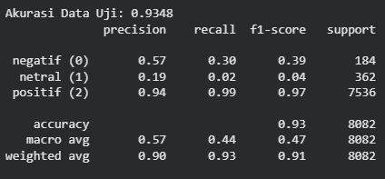
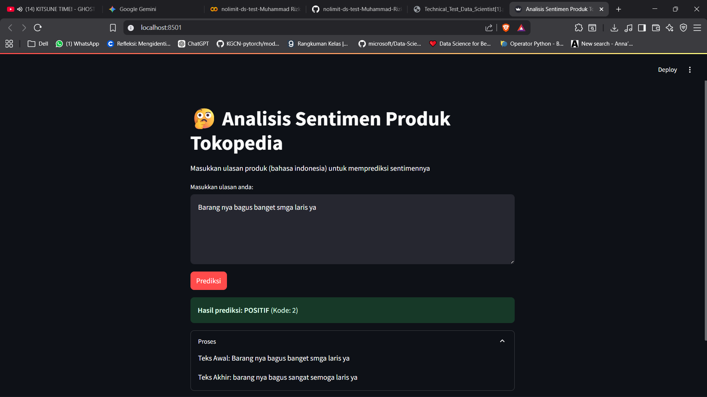
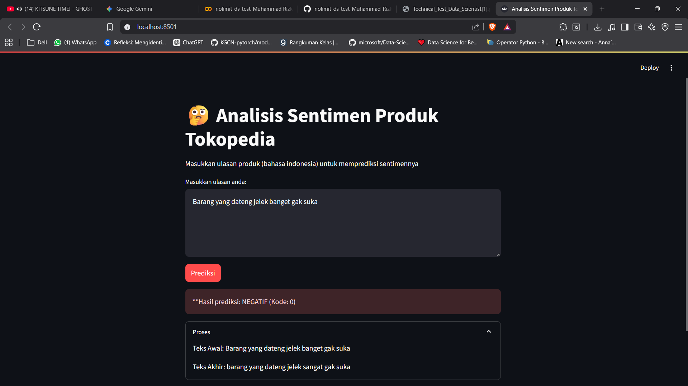

# NLP Classification TASK A (Analisis Sentiment Ulasan Produk Tokopedia)

Proyek ini merupakan implementasi *end-to-end pipeline* Natural Language Processing (NLP) dalam melakukan klasifikasi analisis sentiment pada ulasan produk Tokopedia

## 1. Dataset
* **Sumber:** Dataset yang digunakan berasal dari kaggle [Tokopedia Product Reviews](https://www.kaggle.com/datasets/farhan999/tokopedia-product-reviews)
* **Kolom Dataset:**
| Kolom | Tipe Data | Keterangan |
| :--- | :--- | :--- |
| **text** | `string` | Teks ulasan yang ditulis oleh pelanggan. (Digunakan sebagai fitur/Input **X**) |
| **rating** | `integer` | Nilai rating yang diberikan oleh pengulas (skala 1-5). (Digunakan untuk membuat **Label**) |
| **category** | `string` | Kategori produk, seperti `fashion`, `elektronik`, `handphone`, dll. |
| **product_name** | `string` | Nama lengkap produk. |
| **product_id** | `string` | Pengenal unik untuk produk. |
| **sold** | `integer` | Jumlah barang yang terjual. |
| **shop_id** | `string` | Pengenal unik untuk toko/penjual. |
| **product_url** | `string` | Tautan (URL) ke halaman produk. |

* **Anotasi Label:** Dataset asli tidak memiliki label sentimen, sehingga label dibuat secara manual berdasarkan kolom `rating` (1-5) dengan ketentuan:
   * **positif** Rating 4 atau 5
   * **netral** Rating 3
   * **negatif** Rating 2 atau 1

---

## 2. Flowchart


### Tahapan Load data & preprocessing:
1. **Download Dataset:** Dataset di download dari kaggle dengan tipe file .csv
2. **Load Data:** Dataset yang sudah di download kemudian dimasukkan kedalam google colab untuk mengecek kondisi data
3. **Hapus Kolom yang tidak digunakan:** Karena nlp klasifikasi hanya membutuhkan kolom text dan kolom rating, sehingga kolom yang lain akan dilakukan penghapusan
4. **Lowercase:** Mengubah semua data di kolom text menjadi huruf kecil
5. **Hapus baris yang hanya berisikan tanda baca**: Baris yang hanya berisikan tanda baca saja akan menjadi noise pada data
6. **Remove_Emoji:** Menghapus semua karakter emoji Unicode
7. **load_slang_dict:** Mengubah kata tidak baku/slang ke bentuk baku bahasa indonesia
8. **remove_repeated_char:**Menghilangkan karakter atau tanda baca yang muncul > 1 secara berurutan (misal: `superrrrr` -> `super`)
9. **Normalize duplication:** Mengubah angka ke bentuk baku (misal: `hati2` -> `hati-hati`)
10. **Labeling:** Menambahkan kolom baru bernama Labeling yang didasarkan pada kolom rating, dengan ketentuan:
   * **positif** Rating 4 atau 5
   * **netral** Rating 3
   * **negatif** Rating 2 atau 1
11. **Label Encoding:**Merubah label positif -> 2, netral -> 1 dan negatif -> 0

### Tahapan Splitting Data, Training dan Evaluasi Model
1. **Splitting Data:**Data yang sudah bersih kemudian dibagi menjadi 80% untuk data latih dan 20% untuk data uji, dengan `stratify` untuk menjaga proporsi label seimbang
2. **Embedding (Sentence-Transfomer):**Menggunakan model `paraphase-multilingual-MiniLM-L12-v2` untuk mengubah semua teks menjadi vektor dengan embedding 384 dimensi
3. **Classification (Sklearn):**Melatih model `LogisticRegression` pada embedding yang dihasilkan model sentence-transfomers
4. **Evaluation:**Mengevaluasi model pada data uji berdasarkan metrik akurasi, classification report dan confusion matrix

---

## 3. Model yang Digunakan (Mandatory)
Pada proyek ini digunakan dua model utama:
1. Model Embedding (HuggingFace)
*  Model: sentence-transfomers/paraphase-multilingual-MiniLM-L12-v2

Model ini dipilih karena memiliki vocabulary untuk bahasa indonesia dan 50+ bahasa lain, berbeda dengan model all-MiniLM-L6-v2 yang khusus untuk bahasa inggris.

2. Model Klasifikasi (Sklearn)
*  Model: LogisticRegression

Model ini dipilih karena cepat, efisien, dan bekerja dengan baik pada embedding berdimensi tinggi.

---

## 4. Setup dan Instalasi
Repository dapat dijalankan menggunakan `venv` atau `conda`
### Menggunakan `venv`
1. *Clone repository* ini:
   ```bash
   git clone [URL_REPO]
   cd [NAMA_FOLDER_REPO]
   ```

2. Buat dan aktifkan *virtual environment*:
   ```bash
    # Buat environment di folder bernama 'venv'
    python -m venv venv
    ```
    ```bash
    # Aktifkan di macOS/Linux
    source venv/bin/activate
    ```
    ```bash
    # (Jika Anda di Windows CMD, gunakan: venv\Scripts\activate.bat)
    # (Jika Anda di Windows PowerShell, gunakan: venv\Scripts\Activate.ps1)
    ```

3. Install *library* yang dibutuhkan:
   ```bash
   pip install -r requirements.txt
   ```
---

### Menggunakan `conda`
1. *Clone repository* ini:
   ```bash
   git clone [URL_REPO]
   cd [NAM_FOLDER_REPO]
   ```

2. Buat dan aktifkan *environment conda*:
   ```bash
   conda create --name nama_proyek python=3.10
   conda activate nama_proyek

3. Install *library* yang dibutuhkan
   ```bash
   pip install -r requirements.txt
   ```
---

## 5. Cara Menjalankan
Alur kerja dari *download dataset*, *load dataset*, *preprocessing*, *training*, dan *evaluasi* berada didalam *notebook* Jupyter:

`nolimit-ds-test-Muhammad Rizki Yanuar.ipynb` atau bisa akses lewat (https://colab.research.google.com/drive/1gjTPLvOaq48p1okoIHJ0A8v0vW--7TN_?usp=sharing)

Jalankan semua sel secara berurutan

## Cara Menjalankan 🚀 Streamlit
setelah instalasi selesai dan environment diaktifkan, pastikan anda berada di direktori utama proyek yang berisikan app.py

```bash
   streamlit run app.py
```
Aplikasi streamlit akan berjalan otomatis di browser

---

## 6. Hasil Evaluasi
Model dievaluasi pada 20% data uji yang belum pernah dilihat sebelumnya.

### Laporan Klasifikasi & Akurasi Model
()

### Confusion Matrix


## 7. Contoh Output



